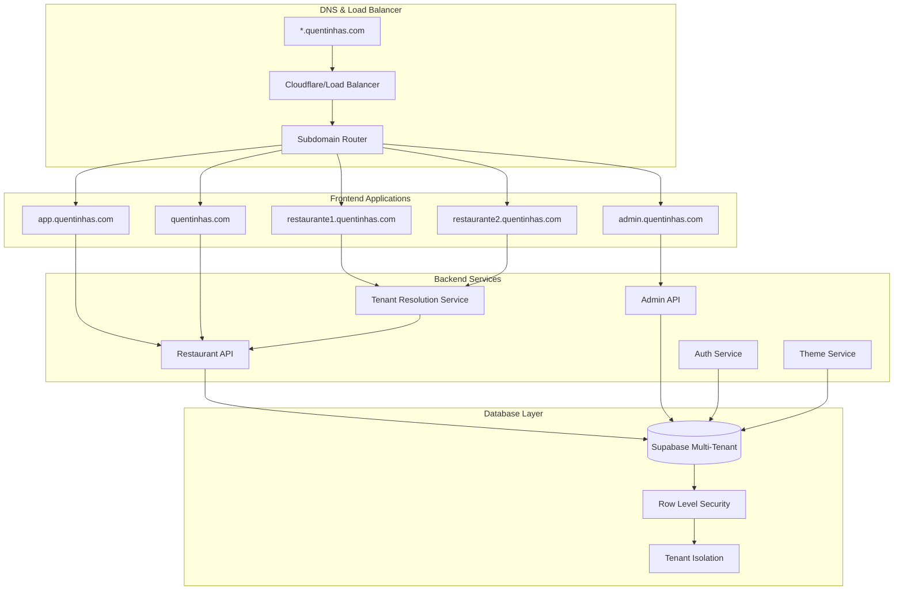

# 🏗️ Arquitetura SaaS B2B2C Multi-Tenant - Quentinhas Platform

## 📋 Visão Geral

Transformação do **Quentinhas Express** de uma aplicação single-tenant para um **SaaS B2B2C multi-tenant** com isolamento por subdomínios, permitindo que múltiplos restaurantes operem de forma independente na mesma plataforma.

## 🎯 Objetivos da Transformação

- **Multi-tenancy**: Isolamento completo de dados por restaurante
- **Subdomínios**: Cada restaurante com seu próprio subdomínio
- **Personalização**: Temas e branding customizáveis por tenant
- **Escalabilidade**: Arquitetura preparada para milhares de restaurantes
- **Administração**: Painel central para gestão da plataforma

## 🏢 Arquitetura Multi-Tenant



## 🌐 Estrutura de Domínios

### Domínios e Subdomínios
```
quentinhas.com                    # Landing page principal
app.quentinhas.com               # Dashboard de onboarding
admin.quentinhas.com             # Painel super admin
[slug].quentinhas.com            # Lojas dos restaurantes
```

### Exemplos de Uso
```
pizzariadojose.quentinhas.com    # Pizzaria do José
lanchoneteana.quentinhas.com     # Lanchonete da Ana
restauranteitaliano.quentinhas.com # Restaurante Italiano
```

## 📁 Nova Estrutura de Projeto

```
src/
├── apps/                        # Aplicações por contexto
│   ├── restaurant/             # App do restaurante (storefront)
│   │   ├── components/
│   │   │   ├── layout/
│   │   │   ├── sections/
│   │   │   └── ui/
│   │   ├── pages/
│   │   │   ├── Menu.tsx
│   │   │   ├── Cart.tsx
│   │   │   └── Checkout.tsx
│   │   ├── hooks/
│   │   └── types/
│   ├── admin/                  # Painel super admin
│   │   ├── components/
│   │   │   ├── dashboard/
│   │   │   ├── tenants/
│   │   │   └── analytics/
│   │   ├── pages/
│   │   │   ├── Dashboard.tsx
│   │   │   ├── Tenants.tsx
│   │   │   └── Analytics.tsx
│   │   └── hooks/
│   ├── restaurant-admin/       # Painel do restaurante
│   │   ├── components/
│   │   │   ├── dashboard/
│   │   │   ├── menu/
│   │   │   ├── orders/
│   │   │   └── settings/
│   │   ├── pages/
│   │   │   ├── Dashboard.tsx
│   │   │   ├── MenuManagement.tsx
│   │   │   ├── Orders.tsx
│   │   │   └── Settings.tsx
│   │   └── hooks/
│   ├── landing/                # Landing page
│   │   ├── components/
│   │   │   ├── hero/
│   │   │   ├── features/
│   │   │   └── pricing/
│   │   ├── pages/
│   │   │   ├── Home.tsx
│   │   │   ├── Pricing.tsx
│   │   │   └── About.tsx
│   │   └── hooks/
│   └── onboarding/             # Processo de cadastro
│       ├── components/
│       │   ├── steps/
│       │   └── forms/
│       ├── pages/
│       │   ├── Register.tsx
│       │   ├── Setup.tsx
│       │   └── Welcome.tsx
│       └── hooks/
├── shared/                     # Componentes compartilhados
│   ├── components/
│   │   ├── ui/                 # shadcn/ui components
│   │   ├── forms/
│   │   ├── layout/
│   │   └── common/
│   ├── hooks/
│   │   ├── use-tenant.ts
│   │   ├── use-theme.ts
│   │   └── use-auth.ts
│   ├── utils/
│   │   ├── tenant.ts
│   │   ├── theme.ts
│   │   └── validation.ts
│   ├── types/
│   │   ├── tenant.ts
│   │   ├── user.ts
│   │   └── restaurant.ts
│   └── constants/
├── services/                   # Serviços de negócio
│   ├── tenant/
│   │   ├── tenant-resolver.ts
│   │   └── tenant-service.ts
│   ├── restaurant/
│   │   ├── restaurant-service.ts
│   │   └── menu-service.ts
│   ├── auth/
│   │   ├── auth-service.ts
│   │   └── permissions.ts
│   ├── theme/
│   │   ├── theme-service.ts
│   │   └── theme-generator.ts
│   └── billing/
│       ├── billing-service.ts
│       └── subscription-service.ts
├── lib/                        # Utilitários core
│   ├── utils.ts
│   ├── validations.ts
│   └── constants.ts
└── integrations/               # Integrações externas
    ├── supabase/
    │   ├── client.ts
    │   ├── types.ts
    │   └── migrations/
    ├── stripe/
    └── analytics/
```

## 🗄️ Modelo de Dados Multi-Tenant

### Schema Principal

```sql
-- Tabela de Tenants (Restaurantes)
CREATE TABLE tenants (
  id UUID PRIMARY KEY DEFAULT gen_random_uuid(),
  slug VARCHAR(50) UNIQUE NOT NULL,
  name VARCHAR(255) NOT NULL,
  email VARCHAR(255) NOT NULL,
  phone VARCHAR(20),
  address JSONB,
  domain VARCHAR(255) UNIQUE,
  status VARCHAR(20) DEFAULT 'active' CHECK (status IN ('active', 'inactive', 'suspended')),
  plan VARCHAR(50) DEFAULT 'starter' CHECK (plan IN ('starter', 'professional', 'enterprise')),
  settings JSONB DEFAULT '{}',
  theme JSONB DEFAULT '{}',
  created_at TIMESTAMP DEFAULT NOW(),
  updated_at TIMESTAMP DEFAULT NOW()
);

-- Tabela de Usuários (Multi-tenant)
CREATE TABLE users (
  id UUID PRIMARY KEY DEFAULT gen_random_uuid(),
  tenant_id UUID REFERENCES tenants(id) ON DELETE CASCADE,
  email VARCHAR(255) NOT NULL,
  password_hash VARCHAR(255),
  role VARCHAR(50) DEFAULT 'customer' CHECK (role IN ('super_admin', 'tenant_admin', 'staff', 'customer')),
  profile JSONB DEFAULT '{}',
  email_verified BOOLEAN DEFAULT false,
  created_at TIMESTAMP DEFAULT NOW(),
  updated_at TIMESTAMP DEFAULT NOW(),
  UNIQUE(tenant_id, email)
);

-- Tabela de Categorias (Por tenant)
CREATE TABLE categories (
  id UUID PRIMARY KEY DEFAULT gen_random_uuid(),
  tenant_id UUID REFERENCES tenants(id) ON DELETE CASCADE,
  name VARCHAR(255) NOT NULL,
  description TEXT,
  max_selections INTEGER DEFAULT 1,
  min_selections INTEGER DEFAULT 0,
  sort_order INTEGER DEFAULT 0,
  active BOOLEAN DEFAULT true,
  created_at TIMESTAMP DEFAULT NOW()
);

-- Tabela de Produtos (Por tenant)
CREATE TABLE products (
  id UUID PRIMARY KEY DEFAULT gen_random_uuid(),
  tenant_id UUID REFERENCES tenants(id) ON DELETE CASCADE,
  category_id UUID REFERENCES categories(id) ON DELETE CASCADE,
  name VARCHAR(255) NOT NULL,
  description TEXT,
  price DECIMAL(10,2) NOT NULL,
  image_url TEXT,
  ingredients JSONB DEFAULT '[]',
  nutritional_info JSONB DEFAULT '{}',
  active BOOLEAN DEFAULT true,
  sort_order INTEGER DEFAULT 0,
  created_at TIMESTAMP DEFAULT NOW(),
  updated_at TIMESTAMP DEFAULT NOW()
);

-- Tabela de Pedidos (Por tenant)
CREATE TABLE orders (
  id UUID PRIMARY KEY DEFAULT gen_random_uuid(),
  tenant_id UUID REFERENCES tenants(id) ON DELETE CASCADE,
  customer_id UUID REFERENCES users(id),
  customer_info JSONB NOT NULL, -- Nome, telefone, endereço
  items JSONB NOT NULL,
  subtotal DECIMAL(10,2) NOT NULL,
  delivery_fee DECIMAL(10,2) DEFAULT 0,
  total DECIMAL(10,2) NOT NULL,
  status VARCHAR(50) DEFAULT 'pending' CHECK (status IN ('pending', 'confirmed', 'preparing', 'ready', 'delivered', 'cancelled')),
  payment_status VARCHAR(50) DEFAULT 'pending' CHECK (payment_status IN ('pending', 'paid', 'failed', 'refunded')),
  payment_method VARCHAR(50),
  notes TEXT,
  estimated_delivery TIMESTAMP,
  delivered_at TIMESTAMP,
  created_at TIMESTAMP DEFAULT NOW(),
  updated_at TIMESTAMP DEFAULT NOW()
);

-- Tabela de Assinaturas
CREATE TABLE subscriptions (
  id UUID PRIMARY KEY DEFAULT gen_random_uuid(),
  tenant_id UUID REFERENCES tenants(id) ON DELETE CASCADE,
  plan VARCHAR(50) NOT NULL,
  status VARCHAR(50) DEFAULT 'active' CHECK (status IN ('active', 'cancelled', 'past_due', 'unpaid')),
  current_period_start TIMESTAMP NOT NULL,
  current_period_end TIMESTAMP NOT NULL,
  stripe_subscription_id VARCHAR(255),
  created_at TIMESTAMP DEFAULT NOW(),
  updated_at TIMESTAMP DEFAULT NOW()
);

-- Índices para performance
CREATE INDEX idx_tenants_slug ON tenants(slug);
CREATE INDEX idx_users_tenant_email ON users(tenant_id, email);
CREATE INDEX idx_products_tenant_category ON products(tenant_id, category_id);
CREATE INDEX idx_orders_tenant_status ON orders(tenant_id, status);
CREATE INDEX idx_orders_created_at ON orders(created_at DESC);

-- Row Level Security (RLS)
ALTER TABLE tenants ENABLE ROW LEVEL SECURITY;
ALTER TABLE users ENABLE ROW LEVEL SECURITY;
ALTER TABLE categories ENABLE ROW LEVEL SECURITY;
ALTER TABLE products ENABLE ROW LEVEL SECURITY;
ALTER TABLE orders ENABLE ROW LEVEL SECURITY;
ALTER TABLE subscriptions ENABLE ROW LEVEL SECURITY;

-- Políticas RLS
CREATE POLICY tenant_isolation_users ON users
  USING (tenant_id = current_setting('app.current_tenant_id', true)::UUID);

CREATE POLICY tenant_isolation_categories ON categories
  USING (tenant_id = current_setting('app.current_tenant_id', true)::UUID);

CREATE POLICY tenant_isolation_products ON products
  USING (tenant_id = current_setting('app.current_tenant_id', true)::UUID);

CREATE POLICY tenant_isolation_orders ON orders
  USING (tenant_id = current_setting('app.current_tenant_id', true)::UUID);

CREATE POLICY tenant_isolation_subscriptions ON subscriptions
  USING (tenant_id = current_setting('app.current_tenant_id', true)::UUID);

-- Função para definir tenant atual
CREATE OR REPLACE FUNCTION set_current_tenant_id(tenant_id UUID)
RETURNS void AS $$
BEGIN
  PERFORM set_config('app.current_tenant_id', tenant_id::text, true);
END;
$$ LANGUAGE plpgsql SECURITY DEFINER;
```

## 🔧 Serviços Core

### 1. Tenant Resolution Service

```typescript
// src/services/tenant/tenant-resolver.ts
export interface Tenant {
  id: string;
  slug: string;
  name: string;
  domain?: string;
  status: 'active' | 'inactive' | 'suspended';
  plan: 'starter' | 'professional' | 'enterprise';
  settings: Record<string, any>;
  theme: TenantTheme;
}

export class TenantResolver {
  private static cache = new Map<string, Tenant>();
  
  static async resolveTenant(hostname: string): Promise<Tenant | null> {
    const subdomain = this.extractSubdomain(hostname);
    
    if (!subdomain || subdomain === 'www') {
      return null; // Landing page
    }
    
    // Casos especiais
    if (['admin', 'app'].includes(subdomain)) {
      return {
        id: subdomain,
        slug: subdomain,
        name: subdomain === 'admin' ? 'Super Admin' : 'Onboarding',
        status: 'active',
        plan: 'enterprise',
        settings: {},
        theme: this.getDefaultTheme()
      } as Tenant;
    }
    
    // Cache check
    if (this.cache.has(subdomain)) {
      return this.cache.get(subdomain)!;
    }
    
    // Buscar tenant no banco
    const { data: tenant, error } = await supabase
      .from('tenants')
      .select('*')
      .eq('slug', subdomain)
      .eq('status', 'active')
      .single();
    
    if (error || !tenant) {
      return null;
    }
    
    // Cache por 5 minutos
    this.cache.set(subdomain, tenant);
    setTimeout(() => this.cache.delete(subdomain), 5 * 60 * 1000);
    
    return tenant;
  }
  
  private static extractSubdomain(hostname: string): string | null {
    // Remove porta se existir
    const cleanHostname = hostname.split(':')[0];
    const parts = cleanHostname.split('.');
    
    // Para desenvolvimento local
    if (cleanHostname.includes('localhost') || cleanHostname.includes('127.0.0.1')) {
      // Formato: tenant.localhost:3000
      return parts[0] !== 'localhost' ? parts[0] : null;
    }
    
    // Para produção: tenant.quentinhas.com
    if (parts.length >= 3) {
      return parts[0];
    }
    
    return null;
  }
  
  private static getDefaultTheme(): TenantTheme {
    return {
      colors: {
        primary: '#FF6B35',
        secondary: '#E63946',
        accent: '#F77F00',
        background: '#FFFFFF'
      },
      logo: '',
      fonts: {
        primary: 'Inter',
        secondary: 'Inter'
      }
    };
  }
}
```

### 2. Theme Service

```typescript
// src/services/theme/theme-service.ts
export interface TenantTheme {
  colors: {
    primary: string;
    secondary: string;
    accent: string;
    background: string;
    foreground?: string;
    muted?: string;
  };
  logo: string;
  favicon?: string;
  fonts: {
    primary: string;
    secondary: string;
  };
  customCSS?: string;
  layout?: {
    headerStyle: 'default' | 'minimal' | 'centered';
    footerStyle: 'default' | 'minimal' | 'hidden';
  };
}

export class ThemeService {
  static applyTheme(theme: TenantTheme) {
    const root = document.documentElement;
    
    // Aplicar cores
    Object.entries(theme.colors).forEach(([key, value]) => {
      root.style.setProperty(`--${key}`, this.hexToHsl(value));
    });
    
    // Aplicar fontes
    root.style.setProperty('--font-primary', theme.fonts.primary);
    root.style.setProperty('--font-secondary', theme.fonts.secondary);
    
    // Aplicar favicon
    if (theme.favicon) {
      this.updateFavicon(theme.favicon);
    }
    
    // Aplicar CSS customizado
    if (theme.customCSS) {
      this.injectCustomCSS(theme.customCSS);
    }
  }
  
  private static hexToHsl(hex: string): string {
    // Converter hex para HSL para compatibilidade com Tailwind
    const r = parseInt(hex.slice(1, 3), 16) / 255;
    const g = parseInt(hex.slice(3, 5), 16) / 255;
    const b = parseInt(hex.slice(5, 7), 16) / 255;
    
    const max = Math.max(r, g, b);
    const min = Math.min(r, g, b);
    let h = 0, s = 0, l = (max + min) / 2;
    
    if (max !== min) {
      const d = max - min;
      s = l > 0.5 ? d / (2 - max - min) : d / (max + min);
      
      switch (max) {
        case r: h = (g - b) / d + (g < b ? 6 : 0); break;
        case g: h = (b - r) / d + 2; break;
        case b: h = (r - g) / d + 4; break;
      }
      h /= 6;
    }
    
    return `${Math.round(h * 360)} ${Math.round(s * 100)}% ${Math.round(l * 100)}%`;
  }
  
  private static updateFavicon(faviconUrl: string) {
    const link = document.querySelector("link[rel*='icon']") as HTMLLinkElement || 
                 document.createElement('link');
    link.type = 'image/x-icon';
    link.rel = 'shortcut icon';
    link.href = faviconUrl;
    document.getElementsByTagName('head')[0].appendChild(link);
  }
  
  private static injectCustomCSS(css: string) {
    const existingStyle = document.getElementById('tenant-custom-css');
    if (existingStyle) {
      existingStyle.remove();
    }
    
    const styleElement = document.createElement('style');
    styleElement.id = 'tenant-custom-css';
    styleElement.textContent = css;
    document.head.appendChild(styleElement);
  }
}
```

## 🚀 Plano de Implementação

### Fase 1: Infraestrutura Base (Semana 1-2)
1. **Setup do banco multi-tenant**
   - Criar schema no Supabase
   - Configurar RLS
   - Migrar dados existentes

2. **Serviços core**
   - Tenant Resolver
   - Theme Service
   - Auth Service multi-tenant

3. **Reestruturação do projeto**
   - Nova estrutura de pastas
   - Context providers
   - Routing multi-app

### Fase 2: Aplicações Frontend (Semana 3-4)
1. **Landing Page**
   - Página principal
   - Pricing
   - Formulário de interesse

2. **Onboarding**
   - Cadastro de restaurantes
   - Setup inicial
   - Configuração de tema

3. **Super Admin**
   - Dashboard principal
   - Gestão de tenants
   - Analytics globais

### Fase 3: Funcionalidades Avançadas (Semana 5-6)
1. **Sistema de billing**
   - Integração Stripe
   - Planos e assinaturas
   - Cobrança automática

2. **Customização avançada**
   - Editor de temas
   - Upload de assets
   - CSS customizado

3. **Analytics e métricas**
   - Dashboard por tenant
   - Métricas globais
   - Relatórios

## 📊 Métricas e KPIs

### Por Tenant
- Pedidos por período
- Ticket médio
- Produtos mais vendidos
- Horários de pico
- Taxa de conversão

### Globais (Plataforma)
- Número de tenants ativos
- Revenue total
- Churn rate
- Crescimento MRR
- Uso de recursos

## 💰 Modelo de Negócio

### Planos de Assinatura
```typescript
export const PLANS = {
  starter: {
    name: 'Starter',
    price: 99,
    currency: 'BRL',
    interval: 'month',
    features: [
      'Até 100 pedidos/mês',
      'Cardápio básico',
      'Suporte por email',
      'Tema padrão'
    ],
    limits: {
      orders: 100,
      products: 50,
      categories: 10
    }
  },
  professional: {
    name: 'Professional',
    price: 199,
    currency: 'BRL',
    interval: 'month',
    features: [
      'Até 500 pedidos/mês',
      'Customização de tema',
      'Suporte prioritário',
      'Analytics avançados',
      'Integração WhatsApp'
    ],
    limits: {
      orders: 500,
      products: 200,
      categories: 25
    }
  },
  enterprise: {
    name: 'Enterprise',
    price: 399,
    currency: 'BRL',
    interval: 'month',
    features: [
      'Pedidos ilimitados',
      'Customização completa',
      'Suporte dedicado',
      'API personalizada',
      'White label'
    ],
    limits: {
      orders: -1, // Ilimitado
      products: -1,
      categories: -1
    }
  }
};
```

## 🔐 Segurança

### Row Level Security (RLS)
- Isolamento automático por tenant_id
- Políticas granulares por tabela
- Prevenção de vazamento de dados

### Autenticação
- JWT com tenant_id
- Roles hierárquicos
- Sessões isoladas por subdomínio

### Validações
- Input sanitization
- Rate limiting por tenant
- Validação de domínios

## 🎯 Próximos Passos

1. **Documentar e aprovar arquitetura**
2. **Configurar ambiente de desenvolvimento**
3. **Implementar migração do banco**
4. **Desenvolver serviços core**
5. **Reestruturar frontend**
6. **Implementar aplicações por contexto**
7. **Testes e deploy**

Esta arquitetura fornece uma base sólida para um SaaS multi-tenant escalável, com isolamento completo de dados e personalização por restaurante.