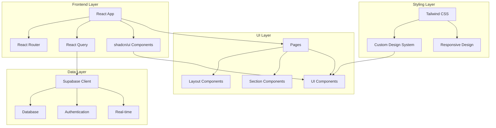
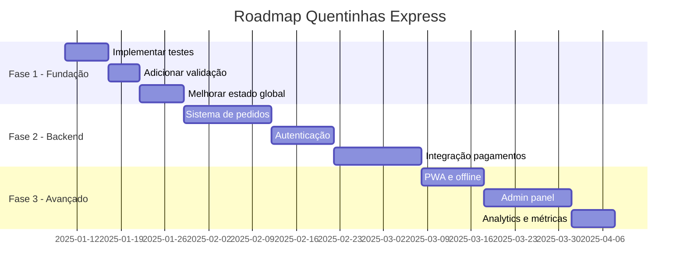

# 🍱 Quentinhas Express

Uma aplicação web moderna para delivery de quentinhas personalizáveis, desenvolvida com React, TypeScript e Supabase.


## 📋 Visão Geral

**Quentinhas Express** é uma plataforma de delivery focada em quentinhas customizáveis, onde os usuários podem montar suas refeições escolhendo entre diferentes bases, proteínas, acompanhamentos e saladas. A aplicação oferece uma experiência intuitiva e responsiva, com design inspirado nos melhores apps de delivery brasileiros.

### ✨ Funcionalidades Principais

- 🍽️ **Montagem Personalizada**: Sistema completo de customização de quentinhas
- 📱 **Design Responsivo**: Interface adaptativa para desktop e mobile
- 🛒 **Carrinho Inteligente**: Validação automática e cálculo de preços
- 🎨 **Design System**: Interface consistente com tema brasileiro
- ⚡ **Performance**: Carregamento rápido com Vite e React Query

## 🚀 Tecnologias

### Frontend
- **React 18** - Biblioteca principal
- **TypeScript** - Tipagem estática
- **Vite** - Build tool e dev server
- **Tailwind CSS** - Framework CSS utilitário
- **shadcn/ui** - Componentes UI modernos

### Backend & Dados
- **Supabase** - Backend as a Service
- **React Query** - Gerenciamento de estado servidor
- **React Router DOM** - Roteamento

### Ferramentas
- **Bun** - Package manager rápido
- **ESLint** - Linting de código
- **PostCSS** - Processamento CSS

## 🏗️ Arquitetura



## 📁 Estrutura do Projeto

```
src/
├── components/          # Componentes reutilizáveis
│   ├── layout/         # Componentes de layout
│   │   └── header.tsx  # Cabeçalho principal
│   ├── sections/       # Seções específicas
│   │   └── hero-section.tsx # Seção hero
│   └── ui/            # Componentes UI base
│       ├── food-card.tsx # Card de produtos
│       └── ingredient-list-item.tsx # Item de ingrediente
├── pages/             # Páginas da aplicação
│   ├── Index.tsx      # Página principal
│   └── NotFound.tsx   # Página 404
├── hooks/             # Custom hooks
├── integrations/      # Integrações externas
│   └── supabase/     # Cliente Supabase
├── lib/              # Utilitários
└── assets/           # Recursos estáticos
```

## 🎨 Sistema de Design

### Paleta de Cores
```css
/* Cores inspiradas no delivery brasileiro */
--primary: 18 100% 60%;        /* Laranja vibrante */
--secondary: 0 85% 60%;        /* Vermelho quente */
--accent: 45 95% 60%;          /* Amarelo dourado */
--muted: 20 15% 95%;           /* Neutro quente */
```

### Componentes Especializados
- **FoodCard**: Cards para exibição de produtos alimentícios
- **IngredientListItem**: Lista interativa de ingredientes
- **Header**: Cabeçalho com informações do restaurante
- **HeroSection**: Seção principal com call-to-action

## 🛠️ Instalação e Uso

### Pré-requisitos
- Node.js 18+ ou Bun
- Git

### Instalação

```bash
# Clone o repositório
git clone <YOUR_GIT_URL>
cd quentinhas

# Instale as dependências (com Bun)
bun install

# Ou com npm
npm install

# Inicie o servidor de desenvolvimento
bun dev
# ou
npm run dev
```

### Scripts Disponíveis

```bash
# Desenvolvimento
bun dev          # Inicia servidor de desenvolvimento
npm run dev

# Build
bun run build    # Build para produção
npm run build

# Linting
bun run lint     # Executa ESLint
npm run lint

# Preview
bun run preview  # Preview da build
npm run preview
```

## 🎯 Funcionalidades Implementadas

### Sistema de Montagem de Quentinha

#### 1. Seleção de Tamanho
- **Quentinha P** - R$ 15,00 - Ideal para matar a fome
- **Quentinha M** - R$ 18,00 - Refeição completa
- **Quentinha G** - R$ 20,00 - Para bom apetite

#### 2. Categorias de Ingredientes

**Base (escolha 1):**
- Arroz Branco
- Arroz Integral

**Proteína (escolha 1):**
- Frango Grelhado
- Carne Moída
- Peixe Grelhado

**Acompanhamentos (até 2):**
- Feijão Carioca
- Feijão Preto
- Farofa
- Batata Frita

**Salada (até 3):**
- Alface
- Tomate
- Cenoura Ralada
- Pepino

### Interface e UX

- **Fluxo Guiado**: Steps numerados para montagem
- **Validação Inteligente**: Verificação de seleções obrigatórias
- **Feedback Visual**: Animações e estados visuais
- **Responsividade**: Adaptação automática para mobile/desktop

## 🔍 Arquitetura Técnica

### Padrões Implementados

1. **Component-Based Architecture**: Separação clara de responsabilidades
2. **Feature-Based Organization**: Agrupamento lógico por funcionalidade
3. **Design System**: Tokens consistentes e reutilizáveis
4. **Type Safety**: TypeScript em toda a aplicação

### Gerenciamento de Estado

```typescript
// Estado local para montagem de quentinha
const [selectedSize, setSelectedSize] = useState<string>('')
const [selectedItems, setSelectedItems] = useState<Record<string, string[]>>({})
const [cartCount, setCartCount] = useState(0)
```

### Integração Supabase

- **Cliente configurado**: Autenticação e persistência
- **Tipos TypeScript**: Tipagem automática do banco
- **Real-time ready**: Preparado para funcionalidades em tempo real

## 📈 Roadmap de Desenvolvimento



## 🚀 Próximas Funcionalidades

### Em Desenvolvimento
- [ ] Sistema completo de pedidos
- [ ] Autenticação de usuários
- [ ] Integração com pagamentos
- [ ] Tracking de pedidos em tempo real
- [ ] Painel administrativo

### Melhorias Técnicas
- [ ] Testes unitários e de integração
- [ ] PWA (Progressive Web App)
- [ ] SEO e meta tags
- [ ] Otimização de performance
- [ ] Modo offline

## 🎨 Design e UX

### Princípios de Design
- **Brasileiro**: Cores e elementos familiares ao público brasileiro
- **Intuitivo**: Fluxo simples e direto
- **Responsivo**: Funciona perfeitamente em qualquer dispositivo
- **Acessível**: Seguindo padrões de acessibilidade web

### Animações e Interações
- Transições suaves com `cubic-bezier`
- Animações de entrada (`fade-in`, `scale-in`)
- Feedback visual em interações
- Estados de loading e erro

## 🤝 Contribuição

1. Fork o projeto
2. Crie uma branch para sua feature (`git checkout -b feature/AmazingFeature`)
3. Commit suas mudanças (`git commit -m 'Add some AmazingFeature'`)
4. Push para a branch (`git push origin feature/AmazingFeature`)
5. Abra um Pull Request

## 📄 Licença

Este projeto está sob a licença MIT. Veja o arquivo `LICENSE` para mais detalhes.

## 🔗 Links Úteis

- **Lovable Project**: https://lovable.dev/projects/3ab1aed2-7716-4337-81db-4f510fe89c34
- **Supabase**: https://supabase.com
- **shadcn/ui**: https://ui.shadcn.com
- **Tailwind CSS**: https://tailwindcss.com

## 📞 Contato

Para dúvidas ou sugestões sobre o projeto, entre em contato através dos canais disponíveis no repositório.

---

**Quentinhas Express** - Desenvolvido com ❤️ para o mercado brasileiro de food delivery.
