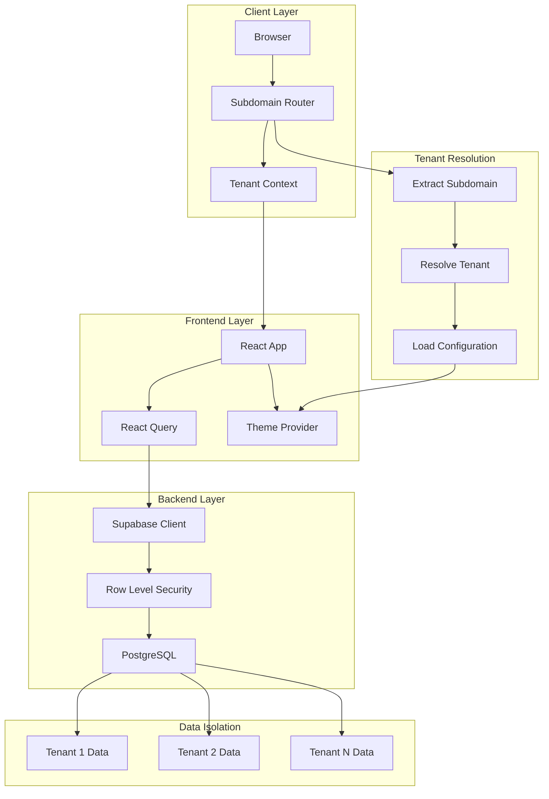

# 🍱 Quentinhas - SaaS Multi-Tenant Food Delivery Platform

Uma plataforma SaaS B2B2C multi-tenant completa para delivery de comida, construída com React, TypeScript, Supabase e arquitetura moderna.


## 🎯 Visão Geral

O **Quentinhas** é uma **plataforma SaaS multi-tenant** que permite que múltiplos restaurantes operem de forma independente com isolamento completo de dados, cada um com seu próprio subdomínio e configurações personalizadas.

### 🏗️ Arquitetura Multi-Tenant

- **Isolamento por Subdomínio**: `restaurante1.quentinhas.com`, `restaurante2.quentinhas.com`
- **Row Level Security (RLS)**: Isolamento de dados no nível do banco
- **Temas Dinâmicos**: Cada tenant pode personalizar cores, logo e fontes
- **Configurações Independentes**: Horários, taxas, métodos de pagamento por tenant

## 🚀 Funcionalidades

### 🏪 **Para Restaurantes (Tenants)**
- 🍕 Gestão completa de cardápio e categorias
- 🛒 Sistema de pedidos em tempo real
- 🎨 Personalização de tema e branding
- ⏰ Configuração de horários de funcionamento
- 💰 Gestão de preços e taxas de entrega
- 📊 Dashboard administrativo

### 👥 **Para Clientes**
- 🔍 Navegação por cardápios
- 🛒 Carrinho de compras intuitivo
- 📱 Interface responsiva
- 💳 Múltiplos métodos de pagamento
- 📍 Sistema de entrega

### 🏢 **Para a Plataforma (SaaS)**
- 🏗️ Onboarding automatizado de novos tenants
- 💼 Gestão de planos e assinaturas
- 📈 Analytics e métricas globais
- 🔧 Configurações de sistema

## 🛠️ Stack Tecnológica

### **Frontend**
- **React 18** - Framework principal
- **TypeScript** - Type safety
- **Vite** - Build tool e dev server
- **Tailwind CSS** - Styling
- **React Query** - State management e cache
- **React Router** - Roteamento

### **Backend & Database**
- **Supabase** - Backend as a Service
- **PostgreSQL** - Banco de dados principal
- **Row Level Security** - Isolamento de dados
- **Real-time subscriptions** - Updates em tempo real

### **Infraestrutura**
- **Subdomain routing** - Isolamento por tenant
- **Multi-tenant architecture** - Arquitetura escalável
- **Environment-based config** - Configuração flexível

## 🏃‍♂️ Início Rápido

### Pré-requisitos

- Node.js 18+
- npm ou yarn
- Conta no Supabase

### Configuração

1. **Clone o repositório:**
```bash
git clone https://github.com/seu-usuario/quentinhas.git
cd quentinhas
```

2. **Instale as dependências:**
```bash
npm install
```

3. **Configure as variáveis de ambiente:**
```bash
cp .env.example .env
```

Edite o `.env` com suas credenciais do Supabase:
```env
VITE_SUPABASE_URL=sua_url_do_supabase
VITE_SUPABASE_ANON_KEY=sua_chave_anonima
```

4. **Execute as migrações do banco:**
```bash
# As migrações estão documentadas em MIGRATION_PLAN.md
# Execute-as no seu painel do Supabase ou via CLI
```

5. **Inicie o servidor de desenvolvimento:**
```bash
npm run dev
```

6. **Acesse a aplicação:**
- **Landing Page**: `http://localhost:8080`
- **Tenant 1**: `http://quentinhas-express.localhost:8080`
- **Tenant 2**: `http://restaurante1.localhost:8080`

## 📁 Estrutura do Projeto

```
src/
├── apps/                   # Aplicações modulares
│   ├── landing/           # Landing page principal
│   ├── restaurant/        # App do restaurante (storefront)
│   ├── admin/            # Painel administrativo
│   └── onboarding/       # Processo de cadastro
├── shared/               # Código compartilhado
│   ├── components/       # Componentes reutilizáveis
│   ├── contexts/         # React contexts
│   ├── types/           # Definições TypeScript
│   ├── constants/       # Constantes e configurações
│   └── utils/           # Funções utilitárias
├── services/            # Serviços e integrações
│   ├── data/           # Serviços de dados
│   ├── tenant/         # Resolução de tenants
│   └── theme/          # Sistema de temas
├── pages/              # Páginas principais
└── hooks/              # Custom hooks
```

## 🏗️ Arquitetura Multi-Tenant



## 📚 Documentação

- **[ARCHITECTURE.md](ARCHITECTURE.md)** - Arquitetura detalhada do sistema
- **[MIGRATION_PLAN.md](MIGRATION_PLAN.md)** - Plano de migração para multi-tenant
- **[IMPLEMENTATION_GUIDE.md](IMPLEMENTATION_GUIDE.md)** - Guia de implementação
- **[PROJECT_ROADMAP.md](PROJECT_ROADMAP.md)** - Roadmap do projeto

## 🔧 Scripts Disponíveis

```bash
npm run dev          # Servidor de desenvolvimento
npm run build        # Build para produção
npm run preview      # Preview do build
npm run lint         # Executar ESLint
npm run type-check   # Verificação de tipos
```

## 🌐 Ambientes

### Desenvolvimento
- **URL Base**: `localhost:8080`
- **Tenants**: `{tenant}.localhost:8080`

### Produção
- **URL Base**: `quentinhas.com`
- **Tenants**: `{tenant}.quentinhas.com`

## 🔐 Segurança

- **Row Level Security (RLS)** habilitado em todas as tabelas
- **Políticas de acesso** por tenant
- **Validação de dados** no frontend e backend
- **Sanitização** de inputs do usuário

## 📊 Banco de Dados

### Estrutura Multi-Tenant

```sql
-- Tabela principal de tenants
CREATE TABLE tenants (
  id UUID PRIMARY KEY DEFAULT gen_random_uuid(),
  slug VARCHAR UNIQUE NOT NULL,
  name VARCHAR NOT NULL,
  email VARCHAR NOT NULL,
  status VARCHAR DEFAULT 'active',
  plan VARCHAR DEFAULT 'starter',
  settings JSONB DEFAULT '{}',
  theme JSONB DEFAULT '{}',
  created_at TIMESTAMP DEFAULT NOW()
);

-- Políticas RLS para isolamento
CREATE POLICY tenant_isolation ON products
  FOR ALL USING (tenant_id = current_tenant_id());
```

### Migrações Executadas

✅ **Migration 1**: Estrutura base multi-tenant  
✅ **Migration 2**: Tabelas de usuários e autenticação  
✅ **Migration 3**: Sistema de produtos e categorias  
✅ **Migration 4**: Sistema de pedidos  
✅ **Migration 5**: Sistema de assinaturas  
✅ **Migration 6**: Dados de exemplo para desenvolvimento  

## 🎨 Sistema de Temas

### Personalização por Tenant

```typescript
interface TenantTheme {
  colors: {
    primary: string;
    secondary: string;
    accent: string;
    background: string;
  };
  logo: string;
  fonts: {
    primary: string;
    secondary: string;
  };
}
```

### Aplicação Dinâmica

- CSS Variables atualizadas em tempo real
- Suporte a temas dark/light
- Personalização completa de branding

## 📈 Monitoramento

- **Logs estruturados** para debugging
- **Métricas de performance** via Supabase
- **Error tracking** integrado
- **Analytics** de uso por tenant

## 🚀 Roadmap

### ✅ **Fase 1 - Fundação Multi-Tenant (Concluída)**
- [x] Arquitetura multi-tenant
- [x] Isolamento de dados com RLS
- [x] Roteamento por subdomínio
- [x] Sistema de temas dinâmicos

### 🔄 **Fase 2 - Funcionalidades Avançadas (Em Progresso)**
- [ ] Sistema completo de pedidos
- [ ] Integração com pagamentos
- [ ] Notificações em tempo real
- [ ] Dashboard administrativo

### 📋 **Fase 3 - Escalabilidade (Planejada)**
- [ ] Sistema de onboarding automatizado
- [ ] Analytics avançados
- [ ] API pública para integrações
- [ ] Mobile app

## 🤝 Contribuindo

1. Fork o repositório
2. Crie uma branch para sua feature (`git checkout -b feature/nova-funcionalidade`)
3. Commit suas mudanças (`git commit -m 'Adiciona nova funcionalidade'`)
4. Push para a branch (`git push origin feature/nova-funcionalidade`)
5. Abra um Pull Request

## 📄 Licença

Este projeto está licenciado sob a MIT License - veja o arquivo [LICENSE](LICENSE) para detalhes.

## 🙏 Agradecimentos

- **Supabase** - Backend as a Service
- **Vercel** - Hospedagem e deployment
- **Tailwind CSS** - Framework de CSS
- **React** - Framework frontend

## 📞 Contato

Para dúvidas ou sugestões sobre o projeto, entre em contato através dos canais disponíveis no repositório.

---

**Desenvolvido com ❤️ para revolucionar o delivery de comida no Brasil**
