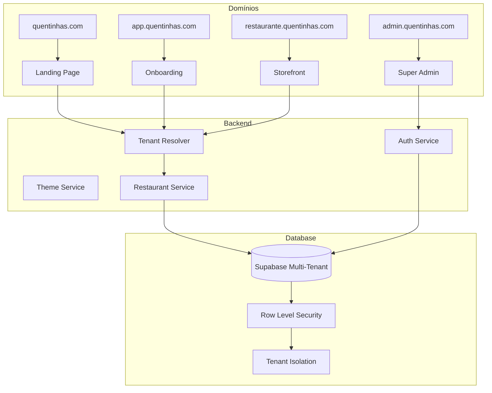

# 🗺️ Roadmap Completo - Quentinhas SaaS Multi-Tenant

## 📋 Status do Projeto

**Situação Atual**: Aplicação single-tenant funcional com dados hardcoded
**Objetivo**: SaaS B2B2C multi-tenant com isolamento por subdomínios
**Prazo Estimado**: 6 semanas de desenvolvimento

## 📚 Documentação Criada

### ✅ Documentos Concluídos

1. **[ARCHITECTURE.md](./ARCHITECTURE.md)** - Arquitetura completa do sistema
   - Diagrama de arquitetura multi-tenant
   - Estrutura de domínios e subdomínios
   - Modelo de dados detalhado
   - Serviços core e integrações

2. **[MIGRATION_PLAN.md](./MIGRATION_PLAN.md)** - Plano de migração detalhado
   - Schema SQL completo
   - Processo de migração passo-a-passo
   - Plano de rollback
   - Scripts de validação

3. **[IMPLEMENTATION_GUIDE.md](./IMPLEMENTATION_GUIDE.md)** - Guia de implementação
   - Estrutura completa de arquivos
   - Código TypeScript detalhado
   - Ordem de implementação
   - Checklist de desenvolvimento

4. **[README.md](./README.md)** - Documentação atualizada do projeto

## 🎯 Próximos Passos Imediatos

### Fase 1: Implementação Base (Semana 1-2)

#### 1.1 Estrutura e Tipos
- [ ] Criar nova estrutura de pastas
- [ ] Implementar tipos TypeScript
- [ ] Configurar constantes e utilitários

#### 1.2 Serviços Core
- [ ] TenantResolver para resolução de subdomínios
- [ ] ThemeService para aplicação de temas
- [ ] Serviços de dados (restaurant, auth)

#### 1.3 Context Providers
- [ ] TenantProvider para gerenciamento de estado
- [ ] Hooks customizados (use-tenant, use-restaurant)
- [ ] Integração com Supabase RLS

### Fase 2: Aplicações Frontend (Semana 3-4)

#### 2.1 Roteamento Multi-App
- [ ] AppRouter para direcionamento por tenant
- [ ] Aplicação do restaurante (storefront)
- [ ] Painel administrativo do restaurante

#### 2.2 Aplicações Especiais
- [ ] Landing page (quentinhas.com)
- [ ] Sistema de onboarding (app.quentinhas.com)
- [ ] Super admin (admin.quentinhas.com)

### Fase 3: Backend e Dados (Semana 5)

#### 3.1 Migração do Banco
- [ ] Executar migrações SQL
- [ ] Migrar dados existentes
- [ ] Configurar Row Level Security

#### 3.2 Funcionalidades Avançadas
- [ ] Sistema de pedidos persistente
- [ ] Autenticação multi-tenant
- [ ] Gestão de usuários por tenant

### Fase 4: Finalização (Semana 6)

#### 4.1 Testes e Validação
- [ ] Testes unitários
- [ ] Testes de integração
- [ ] Validação manual completa

#### 4.2 Deploy e Configuração
- [ ] Configuração de DNS
- [ ] Deploy em produção
- [ ] Monitoramento e métricas

## 🏗️ Arquitetura Resumida

## 📊 Modelo de Negócio

### Planos de Assinatura
- **Starter**: R$ 99/mês - Até 100 pedidos
- **Professional**: R$ 199/mês - Até 500 pedidos  
- **Enterprise**: R$ 399/mês - Ilimitado

### Revenue Streams
- Assinatura mensal/anual
- Taxa por transação (futuro)
- Features premium
- Suporte dedicado

## 🔧 Stack Tecnológico

### Frontend
- **React 18** + **TypeScript**
- **Vite** para build
- **Tailwind CSS** + **shadcn/ui**
- **React Query** para estado servidor
- **React Router** para roteamento

### Backend
- **Supabase** (BaaS)
- **Row Level Security** para isolamento
- **PostgreSQL** como banco principal

### Futuras Integrações
- **Stripe** para pagamentos
- **Vercel Analytics** para métricas
- **WhatsApp API** para notificações

## 🎨 Sistema de Design

### Temas Personalizáveis
- Cores primárias, secundárias e accent
- Logo e favicon customizáveis
- Fontes personalizáveis
- CSS customizado por tenant

### Componentes Reutilizáveis
- Sistema de design consistente
- Componentes especializados para food delivery
- Responsividade automática
- Acessibilidade integrada

## 🔐 Segurança e Isolamento

### Row Level Security (RLS)
- Isolamento automático por tenant_id
- Políticas granulares por tabela
- Prevenção de vazamento de dados

### Autenticação
- JWT com tenant_id
- Roles hierárquicos
- Sessões isoladas por subdomínio

## 📈 Métricas e KPIs

### Por Tenant
- Pedidos por período
- Ticket médio
- Produtos mais vendidos
- Taxa de conversão

### Globais (Plataforma)
- Número de tenants ativos
- Revenue total (MRR)
- Churn rate
- Crescimento de usuários

## 🚀 Funcionalidades Futuras

### Roadmap Estendido (Pós-MVP)

#### Trimestre 1
- [ ] Sistema de pagamentos (Stripe)
- [ ] Notificações WhatsApp
- [ ] Analytics avançados
- [ ] App mobile (React Native)

#### Trimestre 2
- [ ] Programa de fidelidade
- [ ] Cupons e promoções
- [ ] Integração com delivery
- [ ] API pública

#### Trimestre 3
- [ ] Marketplace de restaurantes
- [ ] Sistema de avaliações
- [ ] Chat em tempo real
- [ ] IA para recomendações

## 💡 Decisões Arquiteturais

### Por que Multi-Tenant?
- **Escalabilidade**: Uma instância serve milhares de restaurantes
- **Custo-efetivo**: Recursos compartilhados
- **Manutenção**: Uma base de código para todos
- **Personalização**: Cada tenant com sua identidade

### Por que Subdomínios?
- **Isolamento**: Cada restaurante tem sua URL única
- **SEO**: Melhor indexação por restaurante
- **Branding**: Identidade própria para cada tenant
- **Performance**: Cache otimizado por domínio

### Por que Supabase?
- **Rapidez**: BaaS acelera desenvolvimento
- **RLS**: Isolamento nativo de dados
- **Real-time**: Funcionalidades em tempo real
- **Escalabilidade**: Infraestrutura gerenciada

## 📋 Checklist Final

### Documentação ✅
- [x] Arquitetura definida
- [x] Plano de migração criado
- [x] Guia de implementação detalhado
- [x] Roadmap estabelecido

### Próximas Ações 🎯
- [ ] **Mudar para modo Code**
- [ ] **Iniciar implementação da Fase 1**
- [ ] **Criar estrutura de pastas**
- [ ] **Implementar tipos TypeScript**
- [ ] **Desenvolver serviços core**

## 🎉 Conclusão

O projeto está completamente documentado e pronto para implementação. A arquitetura multi-tenant foi cuidadosamente planejada para garantir:

- **Escalabilidade** para milhares de restaurantes
- **Isolamento** completo de dados
- **Personalização** total por tenant
- **Performance** otimizada
- **Manutenibilidade** a longo prazo

**Status**: ✅ **PRONTO PARA IMPLEMENTAÇÃO**

---

**Próximo passo**: Mudar para o modo **Code** e iniciar a implementação seguindo o [IMPLEMENTATION_GUIDE.md](./IMPLEMENTATION_GUIDE.md).